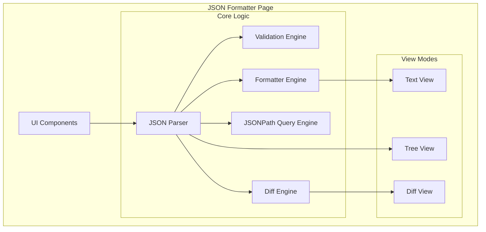

# Design Document: JSON Formatter

## Overview

JSON Formatter เป็น utility page ภายใน My Workspace application สำหรับจัดการ JSON data โดยมีฟีเจอร์หลักคือ format, validate, query, compare และ visualize JSON ออกแบบให้ใช้งานง่ายและรองรับ JSON ขนาดใหญ่

## Architecture



## Components and Interfaces

### Page Component Structure

```
src/pages/json-formatter.tsx
├── JsonFormatterPage (main component)
│   ├── ModeSelector (format/diff/query tabs)
│   ├── FormatMode
│   │   ├── JsonInput (textarea with validation)
│   │   ├── ActionButtons (prettify, minify, copy, download, clear, sample)
│   │   ├── JsonOutput (formatted result)
│   │   └── TreeViewToggle + JsonTreeView
│   ├── DiffMode
│   │   ├── JsonInputLeft
│   │   ├── JsonInputRight
│   │   ├── CompareButton
│   │   └── DiffOutput
│   └── QueryMode
│       ├── JsonInput
│       ├── PathInput (JSONPath query)
│       └── QueryResult
```

### Component Interfaces

```typescript
// Main page props (no external props needed)
interface JsonFormatterPageProps {}

// Mode types
type FormatterMode = 'format' | 'diff' | 'query'

// View types for output
type OutputView = 'text' | 'tree'

// JSON Input component
interface JsonInputProps {
  value: string
  onChange: (value: string) => void
  error?: string | null
  placeholder?: string
  label?: string
}

// Tree View component
interface JsonTreeViewProps {
  data: unknown
  onPathClick?: (path: string) => void
}

// Tree Node for recursive rendering
interface TreeNodeProps {
  name: string
  value: unknown
  path: string
  defaultExpanded?: boolean
}

// Diff Result
interface DiffResult {
  type: 'added' | 'removed' | 'modified' | 'unchanged'
  path: string
  leftValue?: unknown
  rightValue?: unknown
}

// Diff Output component
interface DiffOutputProps {
  results: DiffResult[]
  leftJson: string
  rightJson: string
}
```

### Custom Hook

```typescript
// src/hooks/use-json-formatter.ts
interface UseJsonFormatterReturn {
  // Input state
  input: string
  setInput: (value: string) => void
  
  // Validation
  error: string | null
  isValid: boolean
  parsedJson: unknown | null
  
  // Actions
  prettify: () => string
  minify: () => string
  clear: () => void
  loadSample: () => void
  
  // Query
  queryPath: string
  setQueryPath: (path: string) => void
  queryResult: unknown | null
  queryError: string | null
  
  // Diff (for diff mode)
  leftInput: string
  setLeftInput: (value: string) => void
  rightInput: string
  setRightInput: (value: string) => void
  diffResults: DiffResult[]
  compare: () => void
}
```

## Data Models

### Internal State

```typescript
// Page state
interface JsonFormatterState {
  mode: FormatterMode
  outputView: OutputView
  
  // Format mode
  input: string
  output: string
  
  // Query mode
  queryPath: string
  queryResult: unknown | null
  
  // Diff mode
  leftInput: string
  rightInput: string
  diffResults: DiffResult[]
  
  // Validation
  inputError: string | null
  leftError: string | null
  rightError: string | null
}
```

### Sample JSON Data

```typescript
const SAMPLE_JSON = {
  name: "JSON Formatter",
  version: "1.0.0",
  features: ["prettify", "minify", "validate", "query", "diff"],
  config: {
    indentSize: 2,
    sortKeys: false
  },
  users: [
    { id: 1, name: "Alice", active: true },
    { id: 2, name: "Bob", active: false }
  ],
  metadata: {
    created: "2024-01-15",
    updated: null
  }
}
```

## Correctness Properties

*A property is a characteristic or behavior that should hold true across all valid executions of a system—essentially, a formal statement about what the system should do. Properties serve as the bridge between human-readable specifications and machine-verifiable correctness guarantees.*

### Property 1: Format Round Trip Preservation
*For any* valid JSON string, parsing the prettified or minified output should produce a value deeply equal to parsing the original input.
**Validates: Requirements 3.3, 4.2**

### Property 2: Validation Consistency
*For any* string input, the validation function should return success if and only if `JSON.parse()` succeeds on that input.
**Validates: Requirements 2.1, 2.2, 2.3**

### Property 3: Invalid JSON Error Handling
*For any* invalid JSON string, both prettify and minify operations should return an error result rather than attempting to process.
**Validates: Requirements 3.4, 4.3**

### Property 4: JSONPath Query Subset
*For any* valid JSON and valid JSONPath expression, the query result should be a subset of values that exist in the original JSON at the specified path.
**Validates: Requirements 8.2, 8.5**

### Property 5: Diff Identity
*For any* valid JSON document, comparing it with an identical copy should produce zero differences.
**Validates: Requirements 9.5**

### Property 6: Diff Symmetry
*For any* two valid JSON documents A and B, additions when comparing A→B should appear as deletions when comparing B→A, and vice versa.
**Validates: Requirements 9.2**

### Property 7: Tree View Path Correctness
*For any* valid JSON and any node in its tree representation, the computed JSONPath for that node should correctly locate the same value when used as a query.
**Validates: Requirements 11.4, 11.5, 11.6**

## Error Handling

| Scenario | Error Message | Recovery Action |
|----------|---------------|-----------------|
| Invalid JSON syntax | "JSON ไม่ถูกต้อง: {parse error message}" | Highlight error, show line number if available |
| Empty input on action | "กรุณาใส่ JSON ก่อน" | Focus input field |
| Invalid JSONPath | "JSONPath ไม่ถูกต้อง: {error}" | Show syntax hint |
| No query results | "ไม่พบข้อมูลที่ตรงกับ path นี้" | Suggest checking path |
| Copy failed | "ไม่สามารถคัดลอกได้" | Show manual copy instruction |
| JSON too large | "JSON มีขนาดใหญ่เกินไป (สูงสุด 1MB)" | Suggest splitting data |

## Testing Strategy

- no testing
